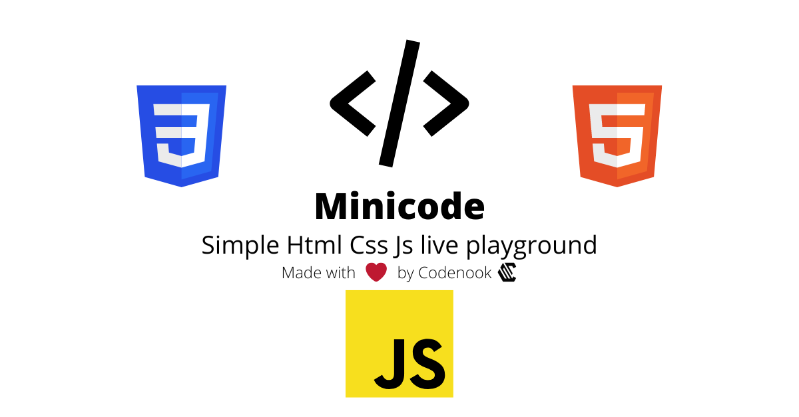

# Minicode | Html Css Js live playground

Minicode is a simple and fast Html Css Js live playground inspired in [CodePen](codepen.com) and [codi.link](codi.link).

[Open Minicode](minicode.netlify.app)

## Features

- Emmet support
- Light/Dark themes
- Responsive
- Light and fast
